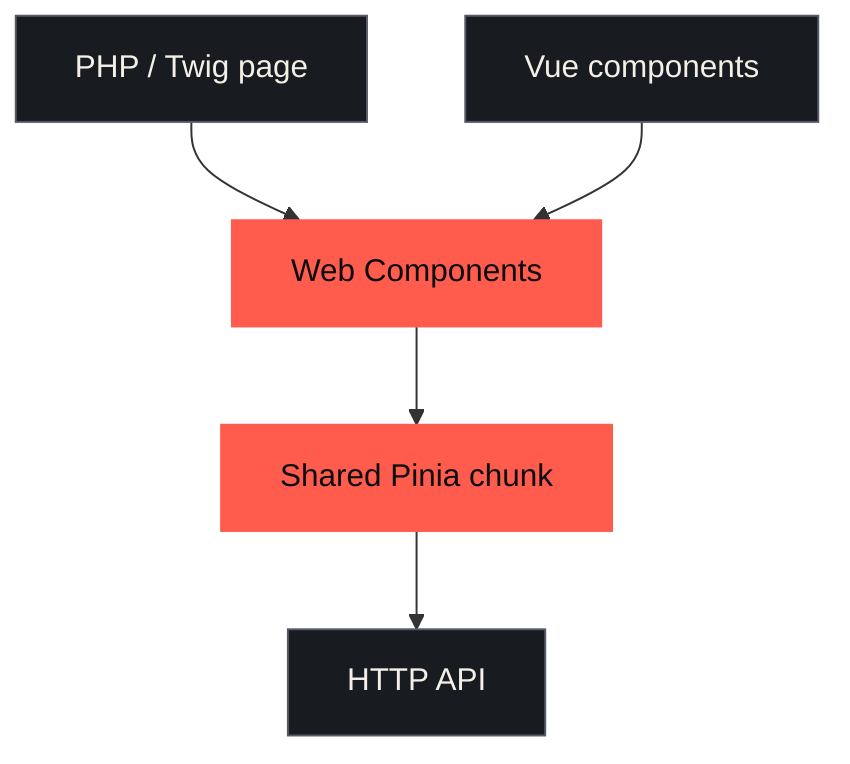
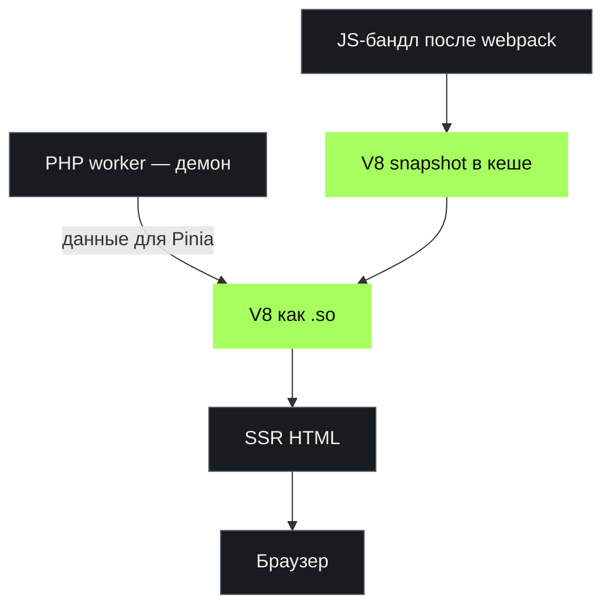

<div class="eyebrow">Факап-митап · Магнит Тех</div>

# Я переезжаю на Nuxt

## Если что — я лоханулся

<div class="cover-meta">
  <span>Пётр Белобородов</span>
  
</div>

<!--
0:00–0:40

Я Пётр. В соло делаю Networkly — каталог IT-мероприятий.
Решил перевезти довольно странный, но рабочий PHP+Vue-монолит на Nuxt.
Сразу спойлер: быстрее не стало.
-->

---
layout: default
class: speaker-slide
---

# Кто я

<div class="speaker-content">
<figure class="speaker-portrait">

</figure>

<div class="speaker-bio">

<div class="big-copy">
  <strong>Пётр Белобородов</strong><br>
  <span class="speaker-role">fullstack PHP + JS</span>
</div>

<ul>
  <li>13 лет в индустрии за деньги</li>
  <li>Продуктовый разработчик</li>
  <li>В основном работаю в небольших компаниях</li>
</ul>

</div>
</div>

<!--
0:40–1:00

Пётр Белобородов, fullstack PHP + JS. В индустрии за деньги уже 13 лет.
Позиционирую себя как продуктового разработчика, работаю в основном
в небольших компаниях.
-->

---
layout: two-cols-header
---

# Что я делаю

::left::

<div class="networkly-lockup">
  
  <span>В соло делаю каталог IT-мероприятий.</span>
</div>

::right::

<div class="stack-list">
  <div class="stack-row">
    <span class="tech-label">
      
      <span>PHP</span>
    </span>
    <span class="tech-slash">/</span>
    <span class="tech-label">
      
      <span>Symfony</span>
    </span>
  </div>
  <div class="stack-row">
    <span class="tech-label">
      
      <span>Vue</span>
    </span>
    <span class="tech-slash">/</span>
    <span class="tech-label">
      
      <span>Pinia</span>
    </span>
  </div>
  <div class="stack-row stack-row-text">
    <span>V8 внутри PHP</span>
  </div>
  <div class="stack-row accent">
    <span class="tech-label">
      
      <span>теперь ещё Nuxt</span>
    </span>
  </div>
</div>

<SlidevVideo v-click autoplay autoreset="slide" controls muted playsinline class="absolute inset-0 w-full h-full object-contain bg-[#0b0d0f]" aria-label="Демонстрация интерфейса Networkly">
  <source src="/networkly-demo.mp4" type="video/mp4" />
</SlidevVideo>

<!--
Около минуты вместе с роликом.

Networkly — живой сервис, который я разрабатываю один, поэтому весь
технический долг — персональный и очень близкий. Коротко показать стек.

[click] Ролик на 42 секунды: показать интерфейс и рассказать,
что он позволяет делать и зачем я развиваю этот проект.
-->

---
layout: default
---

# Зачем я делаю Networkly

<figure class="m-0">

<figcaption class="mt-2 text-sm muted">Идея проекта, 2019</figcaption>
</figure>

<!--
20–30 секунд.

Это моя попытка сформулировать ценность проекта в 2019 году:
помочь IT-специалистам развиваться через сообщества и обмен знаниями.

Сейчас направление немного меняется, но я по-прежнему считаю,
что сообщества и конференции важны. В 2026 году быть в комьюнити
для меня стало ещё важнее. Поэтому я продолжаю делать Networkly.
-->

---
layout: default
---

<div class="eyebrow">Завязка</div>

# Почему я решил переехать

<div v-click class="mb-6">
<h3>Просто захотелось</h3>
<p>Могу себе позволить эксперимент. Академический интерес.</p>
</div>

<div v-click class="mb-6">
<h3>Самодельный SSR сложно поддерживать</h3>
<p>Каталог мероприятий должен хорошо индексироваться.<br>SSR для проекта очень важен.</p>
</div>

<div v-click>
<h3>Мини-аппам нужна более удобная основа</h3>
<p>Сейчас они просто на Vue-компоненте — и это не очень удобно.</p>
</div>

<!--
1:25–2:20

[click] Первая причина — просто захотелось. Я могу себе позволить этот
эксперимент, у меня есть академический интерес к новому инструменту.

[click] Вторая — самодельный SSR сложно поддерживать. При этом SSR для
проекта очень важен: каталогу мероприятий нужна хорошая индексация.
Хотел получить стандартный механизм вместо поддержки собственного.

[click] Третья — у меня есть мини-аппы. Сейчас они просто на Vue-компоненте,
и такая основа не очень удобна.

Nuxt уже существует. Агент уже существует. Что может пойти не так?
Дальше покажу, как всё было устроено до переезда.
-->

---
layout: two-cols-header
---

# Как было устроено: клиент

::left::

- Vue-компоненты в PHP-страницах
- из компонентов собирались Web Components
- Pinia оставался единым благодаря chunk splitting
- разные части страницы жили как компоненты

::right::



<!--
2:20–3:20

Подчеркнуть: система была странной, но не случайной. Компоненты уже были,
данные и состояние уже разделялись, а один Pinia переиспользовался между
островами через chunk splitting.
-->

---
layout: default
---

# Один Pinia → Vue → Web Component

````md magic-move {lines: true}
```ts
// utils/webComponentPinia.ts
// Общий экземпляр Pinia для всех Web Components
export const webComponentPinia = createPinia()
```

```ts
// eventPersonalWeek.ts
import EventPersonalWeek from './view/EventPersonalWeek.vue'
import { webComponentPinia } from './utils/webComponentPinia'

const Element = defineCustomElement(EventPersonalWeek, {
  shadowRoot: false,
  configureApp(app) {
    app.use(webComponentPinia)
  },
})
```

```ts
// eventPersonalWeek.ts
import EventPersonalWeek from './view/EventPersonalWeek.vue'
import { webComponentPinia } from './utils/webComponentPinia'

const Element = defineCustomElement(EventPersonalWeek, {
  shadowRoot: false,
  configureApp(app) {
    app.use(webComponentPinia)
  },
})

customElements.define('event-personal-week', Element)
```
````

<!--
3:20–4:00

Pinia создаётся один раз в JS-модуле и используется всеми Web Components.
При импорте компоненты получают тот же экземпляр, а не создают новый.
Быстро прокликать три состояния:
обычный Vue SFC передаётся в defineCustomElement; configureApp подключает тот
же Pinia; customElements.define регистрирует тег.
-->

---
layout: two-cols-header
---

# Как было устроено: сервер

::left::



::right::

<div class="aside">
  <strong>Да, это работало.</strong><br>
  PHP не умирал, V8 жил внутри него.<br>
  Компоненты рендерились на сервере.
</div>

<div class="failure-copy server-flaw">
  <strong>Но правила URL жили дважды</strong>
  <code>/event?event_filter[city_id][]=524901</code>
  <span>→ 301 /event/moscow</span>
  PHP и JS независимо разбирали один фильтр.
</div>

<!--
4:00–4:25

Это место можно рассказывать с удовольствием: PHP работал демоном,
V8 подгружался как so-библиотека, а в SSR прокидывались заранее
подготовленные данные для Pinia.

Snapshot — снимок V8 после загрузки JS-бандла, а не данные Pinia.
Данные текущего запроса PHP готовит отдельно и передаёт в renderSsr.

Да, звучит дико. Но оно работало.

Концептуальная цена — дублирование логики. И PHP, и JavaScript должны были
разобрать event_filter, понять, что 524901 — Москва, и знать канонический
адрес /event/moscow. Эти правила могли разъехаться.
-->

---
layout: default
---

# SSR: JS → snapshot → HTML

<p class="lead">
<strong class="accent">{{ $clicks === 0 ? 'JavaScript' : 'PHP' }}</strong>
— {{ ['Готовый ssr.js', 'Читаем JS и создаём snapshot', 'Готовим данные вместо запросов к API', 'Вызываем функцию через V8 и получаем HTML'][$clicks] }}
</p>

````md magic-move {lines: true}
```js
import { renderToString } from 'vue/server-renderer' // Vue → HTML

function renderSsr(dataFromPhp) {
  const vueApp = createVueCatalog() // Vue-приложение с каталогом
  fillPiniaWithEvents(dataFromPhp.events) // данные PHP → Pinia
  return renderToString(vueApp) // возвращаем HTML-строку
}

global.renderSsr = renderSsr // эту функцию вызовет PHP через V8
```

```php
// Подготавливаем и кешируем V8 snapshot
$snapshot = $this->ssrCachePool->get($key, function () {
    $js = file_get_contents('ssr.js'); // читаем готовый webpack-бандл
    return V8Js::createSnapshot($js);
});
```

```php
// Эмулируем API внутри PHP, без HTTP
$context = [
    'locale'   => 'ru',
    'events'   => emulateGet('/api/events?...'),
    'tags'     => emulateGet('/api/tags?...'),
    'geonames' => emulateGet('/api/geonames/published'),
];
```

```php
$v8 = new V8Js('php', [], $snapshot); // V8 с подготовленным скриптом
$contextJson = json_encode($context); // данные для Pinia

// Строка — JS внутри V8; результат возвращается в PHP
$html = new V8($v8)->run(
    "globalThis.renderSsr({$contextJson}).then(html => print(html));"
);
```
````

<!--
4:25–4:50

Четыре состояния: сначала JavaScript, затем три шага на стороне PHP.
ssr.js — условное короткое имя настоящего eventsListSsrFunc.js.

Сначала показываю, что делает собранный JS: получает данные, заполняет
Pinia, рендерит Vue в HTML и выставляет renderSsr в global.
createVueCatalog и fillPiniaWithEvents — условные имена для схемы:
создание Vue-приложения каталога и заполнение его Pinia данными из PHP.
renderToString — настоящая функция из vue/server-renderer. Импорт показан
для пояснения; в готовом webpack-бандле эта зависимость уже собрана.

[click] PHP читает этот файл и создаёт кешируемый V8 snapshot. $key в
примере сокращён: в реальном коде ключ зависит от хеша webpack-бандла.

[click] Для запроса PHP готовит context: эмулирует ответы API без HTTP.

[click] Всё ещё PHP: создаёт V8 со snapshot, передаёт JSON и запускает
globalThis.renderSsr. Строка выполняется как JS внутри V8; HTML получаем в PHP.
-->

---
layout: center
class: metric-slide lebowski-slide
---

<div class="eyebrow">План был простой</div>

# Отдать страницу агенту → получить Nuxt → переключить маршрут

<div v-click="1" class="lebowski-reaction">
  <blockquote class="lebowski-quote">
    Хороший план.<br>
    <strong>Надёжный, как швейцарские часы.</strong>
  </blockquote>
  
</div>

<div v-click="2" class="commit-reveal">
  <div class="mega-commit">
    <span>303 файла</span>
    <span class="plus">+34 969</span>
    <span class="minus">−11 369</span>
  </div>

  <p class="muted">Один исходный коммит. Что-то современное явно произошло.</p>
</div>

<!--
4:50–5:40

Исходный Nuxt-коммит c446191c затронул 303 файла.
Это не обязательно плохо само по себе, но отлично показывает разницу
между ожидаемым переносом страницы и фактическим созданием второго приложения.

[click] Хороший план. Надёжный, как швейцарские часы.

[click] И только потом — масштаб исходного коммита: 303 файла.
-->

---
layout: two-cols-header
---

# Минус №1. Страница ждёт вообще всех

::left::

```ts {2|3-8|9-12|all}
const event = await api('/events/:id')
const base = await Promise.allSettled([
  schedule(),
  registrationSettings(),
  features(),
  communityEvents(),
  recommendationProfile(),
])
const related = await Promise.allSettled([
  sameDayEvents(),
  similarEvents(),
])
```

::right::

<div class="failure-copy">
  <strong>SSR critical path</strong>
  стал равен всей странице
</div>

<ul class="compact">
  <li>медленный первый ответ</li>
  <li>раздутый composable</li>
  <li>секции нельзя загружать независимо</li>
  <li>ручная раскладка по четырём store</li>
</ul>

<!--
5:40–7:20

Утром начал тестировать. Формально страница работала — просто медленно.

Агент собрал всю страницу в aggregate loader: сначала событие, потом пять
запросов, потом ещё два, затем разложил результат по четырём Pinia stores.

Важно: это не хитрая проблема Nuxt. Подход был странным сам по себе.
Первое, что пришлось сделать, — объяснить агенту недопустимость такой схемы.
-->

---
layout: image
image: /diff-use-event-page.png
class: screenshot-slide
---

<div class="screenshot-caption">
  <span class="eyebrow">Исправление 03b6778c</span>
  <strong>−66 строк из useEventPage</strong>
  <small>Данные вернулись к компонентам, которым они нужны</small>
</div>

<!--
7:20–8:10

Показать реальный diff. После переделки composable снова загружал только
само мероприятие. Расписание, регистрация, похожие события и прочие блоки
вернулись к своим компонентам.
-->

---
layout: two-cols-header
---

# Минус №2. Две версии правил мета-информации

::left::

<div class="truth-box">
  <span>Symfony</span>
  <strong>title, description,<br>дата, schema.org,<br>приватный адрес</strong>
</div>

::right::

<div class="truth-box danger">
  <span>Nuxt / eventSeo.ts</span>
  <strong>title, description,<br>дата, schema.org,<br>приватный адрес</strong>
</div>

<div class="bottom-line">
  Переделал на HTTP-ручку. Сомнительно? Да.<br>
  Но один лишний запрос дешевле двух версий правил.
</div>

<!--
8:10–9:50

Не называть это абстрактной «доменной политикой». Это конкретные правила
оформления мета-информации и structured data, включая приватный адрес.

Агент независимо реализовал их в eventSeo.ts. Пришлось удалить копию
и получать уже вычисленный результат с backend.
-->

---
layout: two-cols-header
---

# Минус №3. Агент строил новый проект.<br>Я мигрировал старый

::left::

<div class="migration-side migration-expectation">
  <small>Агент видел</small>
  <div class="nuxt-only">
    
    <strong>Nuxt</strong>
  </div>
  <span>новый хозяин компонента</span>
</div>

::right::

<div class="migration-side migration-reality">
  <small>В реальности</small>
  <div class="shared-component">общий Vue-компонент</div>
  <div class="shared-arrow">↓ используют</div>
  <div class="shared-consumers">
    <span>Legacy / Twig</span>
    <span>Web Components</span>
    <span>Nuxt</span>
  </div>
</div>

<div class="bottom-line">
  Общий компонент адаптировали под Nuxt — и забыли проверить старых потребителей.
</div>

<!--
9:50–11:10

Это не рассказ про один неудачный boolean. Агент смотрел на Nuxt как на новый
проект и нового владельца компонентов. Но это была миграция живой системы:
те же Vue-компоненты продолжали использовать Legacy / Twig и Web Components.

Реальный пример из исправления 4173a3ec — необязательный loadOnFilterChange.
Nuxt явно передавал false, старые потребители не передавали ничего и тоже
получили falsy. Конкретный баг — доказательство, а не главный тезис.
-->

---
layout: center
class: statement-slide result-slide
---

<div class="result-layout">
<div class="result-copy">
<div class="eyebrow">Что получилось</div>

<h1>Код появился быстрее,<br>чем я научился его <span class="accent">валидировать</span></h1>

<div class="fix-stream">
Проверки были. Но не всё важное они проверяли.
</div>
</div>

<figure v-click class="result-meme">

</figure>
</div>

<!--
11:10–12:15

Не превращать агента в злодея. Проблема в разрыве скорости:
код генерируется мгновенно, а понимание нового фреймворка — нет.

Уверенный рабочий код ещё надо уметь отличить от уверенно выглядящего.

Функциональные тесты сделали эксперимент возможным, но не ловили рост
связности, сложности и времени ответа. Как проверять эти свойства
автоматически — для меня пока открытый вопрос, а не готовый вывод.

[click] И вот это довольно точно описывает, как ощущался результат.
-->

---
layout: default
---

# Что я из этого вынес

<div class="lessons">
  <div v-click class="lesson">
    <span class="lesson-number">01</span>
    <div class="lesson-copy">
      <strong>Nuxt всё равно придётся изучить.</strong>
      <p>Агент ускоряет написание кода, но не заменяет понимание.</p>
    </div>
  </div>
  <div v-click class="lesson">
    <span class="lesson-number">02</span>
    <div class="lesson-copy">
      <strong>Нельзя делегировать то, что не умеешь проверять.</strong>
      <p>Если я не понимаю, как правильно, то не отличу хорошее решение от правдоподобного.</p>
    </div>
  </div>
  <div v-click class="lesson">
    <span class="lesson-number">03</span>
    <div class="lesson-copy">
      <strong>Без тестов я бы не рискнул менять живой проект.</strong>
      <p>Они сделали эксперимент возможным, но не гарантировали качество всех решений.</p>
    </div>
  </div>
</div>

<!--
12:15–13:45

[click] Агент ускоряет написание кода, но не заменяет понимание.

[click] Если я не понимаю, как правильно, то не отличу хорошее решение от правдоподобного.

[click] Без тестов я бы не стал даже пробовать. Они сделали эксперимент
возможным, но не гарантировали качество всех решений.
-->

---
layout: center
class: final-slide
---

# Резюме-девелопмент — сосёт.

<div class="final-word">Но хорошо, что я попробовал.</div>

<!--
13:45–15:00

«Резюме-девелопмент» — это выбор технологий ради строчки в резюме,
а не ради пользы для продукта, иногда ещё и без достаточной квалификации.
Не development вообще. Сам эксперимент всё равно оказался полезным.

Я всё ещё не решил: продолжать миграцию или откатить. Эксперимент дал знания,
но ещё не доказал, что миграцию стоит продолжать.
-->
