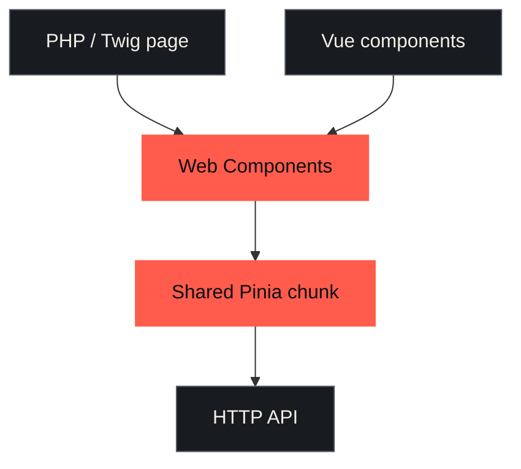
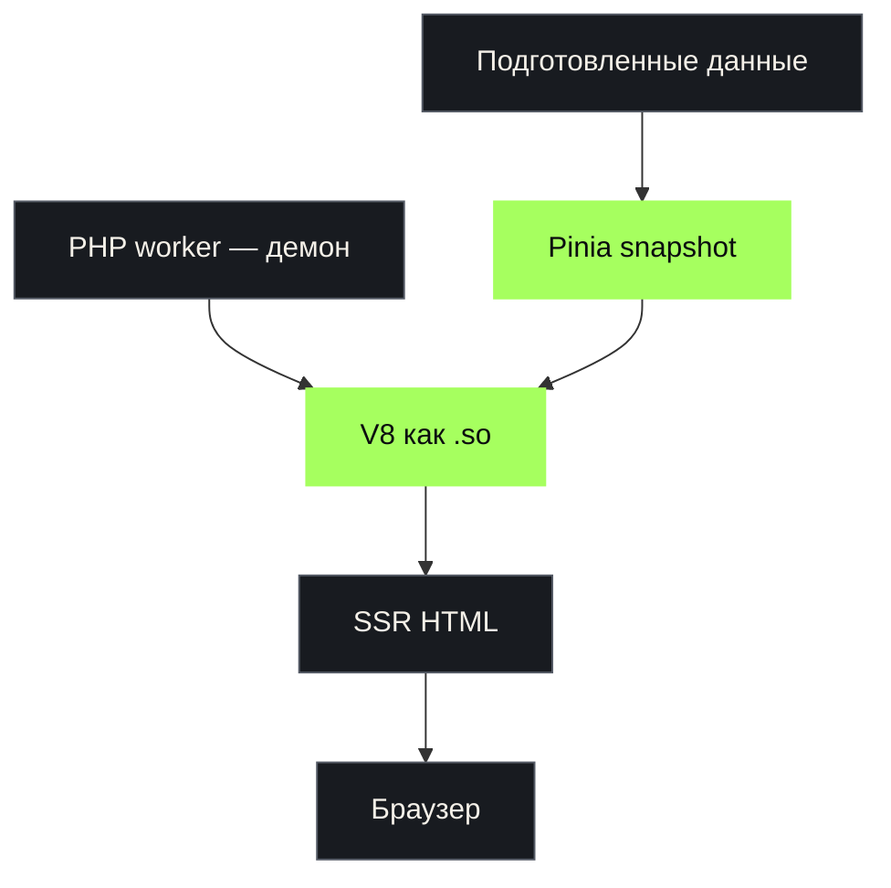

<div class="eyebrow">Факап-митап · Магнит Тех</div>

# Я переезжаю на Nuxt

## Если что — я лоханулся

<div class="cover-meta">
  <span>Пётр Белобородов</span>
  
</div>

<!--
0:00–0:40

Я Пётр. В соло делаю Networkly — каталог IT-мероприятий.
Решил перевезти довольно странный, но рабочий PHP+Vue-монолит на Nuxt.
Сразу спойлер: быстрее не стало.
-->

---
layout: two-cols-header
---

# Кто я и что я делаю

::left::

<div class="big-copy">
  <strong>Пётр</strong><br>
  fullstack PHP + JS
</div>

<div class="networkly-lockup">
  
  <span>В соло делаю каталог IT-мероприятий.</span>
</div>

::right::

<div class="stack-list">
  <div class="stack-row">
    <span class="tech-label">
      
      <span>PHP</span>
    </span>
    <span class="tech-slash">/</span>
    <span class="tech-label">
      
      <span>Symfony</span>
    </span>
  </div>
  <div class="stack-row">
    <span class="tech-label">
      
      <span>Vue</span>
    </span>
    <span class="tech-slash">/</span>
    <span class="tech-label">
      
      <span>Pinia</span>
    </span>
  </div>
  <div class="stack-row stack-row-text">
    <span>V8 внутри PHP</span>
  </div>
  <div class="stack-row accent">
    <span class="tech-label">
      
      <span>теперь ещё Nuxt</span>
    </span>
  </div>
</div>

<!--
0:40–1:25

Коротко представиться. Не объяснять продукт подробно: достаточно сказать,
что это живой сервис, который я разрабатываю один, поэтому весь технический
долг — персональный и очень близкий.
-->

---
layout: center
class: statement-slide
---

<div class="eyebrow">Завязка</div>

# Мне захотелось<br><span class="accent">нормальный современный фронтенд</span>

<p class="muted lead">Nuxt уже существует. Агент уже существует.<br>Что может пойти не так?</p>

<!--
1:25–2:20

Мотивация была нормальной: получить современный frontend-фреймворк,
понятный SSR и постепенно уйти от самодельной схемы.

С агентом миграция казалась не отдельным проектом, а задачей на вечер.
-->

---
layout: two-cols-header
---

# Как было устроено: клиент

::left::

- Vue-компоненты в PHP-страницах
- из компонентов собирались Web Components
- Pinia оставался единым благодаря chunk splitting
- разные части страницы жили как компоненты

::right::



<!--
2:20–3:20

Подчеркнуть: система была странной, но не случайной. Компоненты уже были,
данные и состояние уже разделялись, а один Pinia переиспользовался между
островами через chunk splitting.
-->

---
layout: default
---

# Один Pinia → Vue → Web Component

````md magic-move {lines: true}
```ts
// utils/webComponentPinia.ts
export const webComponentPinia = createPinia()
```

```ts
// eventPersonalWeek.ts
import EventPersonalWeek from './view/EventPersonalWeek.vue'
import { webComponentPinia } from './utils/webComponentPinia'

const Element = defineCustomElement(EventPersonalWeek, {
  shadowRoot: false,
  configureApp(app) {
    app.use(webComponentPinia)
  },
})
```

```ts
// eventPersonalWeek.ts
import EventPersonalWeek from './view/EventPersonalWeek.vue'
import { webComponentPinia } from './utils/webComponentPinia'

const Element = defineCustomElement(EventPersonalWeek, {
  shadowRoot: false,
  configureApp(app) {
    app.use(webComponentPinia)
  },
})

customElements.define('event-personal-week', Element)
```
````

<!--
3:20–4:00

Быстро прокликать три состояния: Pinia создаётся один раз в отдельном модуле;
обычный Vue SFC передаётся в defineCustomElement; configureApp подключает тот
же Pinia; customElements.define регистрирует тег.
-->

---
layout: two-cols-header
---

# Как было устроено: сервер

::left::



::right::

<div class="aside">
  <strong>Да, это работало.</strong><br>
  PHP не умирал, V8 жил внутри него.<br>
  Компоненты рендерились на сервере.
</div>

<div class="failure-copy server-flaw">
  <strong>Но правила URL жили дважды</strong>
  <code>/event?event_filter[city_id][]=524901</code>
  <span>→ 301 /event/moscow</span>
  PHP и JS независимо разбирали один фильтр.
</div>

<!--
4:00–4:25

Это место можно рассказывать с удовольствием: PHP работал демоном,
V8 подгружался как so-библиотека, а в SSR прокидывались заранее
подготовленные данные для Pinia.

Да, звучит дико. Но оно работало.

Концептуальная цена — дублирование логики. И PHP, и JavaScript должны были
разобрать event_filter, понять, что 524901 — Москва, и знать канонический
адрес /event/moscow. Эти правила могли разъехаться.
-->

---
layout: default
---

# SSR: webpack → PHP → V8 → Pinia

````md magic-move {lines: true}
```php
// EventService.php
$snapshotSourcePath = __DIR__.'/../../public/build/eventsListSsrFunc.js'; // webpack output
$snapshotCacheKey = 'snapshot_'.hash_file('sha256', $snapshotSourcePath);

$snapshot = $this->ssrCachePool->get($snapshotCacheKey,
    static function () use ($snapshotSourcePath) {
        return V8Js::createSnapshot(file_get_contents($snapshotSourcePath)); // read → V8 cache
    });
```

```php
// Смысл реального кода: эмулируем API-запросы внутри PHP
$apiResponses = [
    'events'   => emulateGet('/api/events?...'),
    'tags'     => emulateGet('/api/tags?...'),
    'geonames' => emulateGet('/api/geonames/published'),
]; // никакого HTTP
```

```php
// EventService.php
$context = json_encode(['events' => $normalizedEvents, /* ... */]); // payload для Pinia
$v8 = new V8Js('php', [], $snapshot); // кешированный webpack-бандл

$html = (new V8($v8))->run(
    "var context={$context}; renderSsr(context).then(html => print(html));"
);
```

```ts
// eventsListSsrFunc.ts — код уже выполняется внутри V8
const { app } = BaseEventsList(context.locale)

useEventsStore().setStateFromResponse(JSON.parse(context.events)) // PHP → Pinia
usePublishedGeonamesStore().applyGeonames(JSON.parse(context.geonames))

return renderToString(app)
```
````

<!--
4:25–4:50

Четыре быстрых клика: PHP читает webpack-бандл и кеширует V8 snapshot;
запросы к API эмулируются прямо внутри PHP, без HTTP; ответы складываются
в context и уходят в V8; JS гидратирует Pinia и делает renderToString.
-->

---
layout: center
class: metric-slide lebowski-slide
---

<div class="eyebrow">План был простой</div>

# Отдать страницу агенту → получить Nuxt → переключить маршрут

<div v-click="1" class="lebowski-reaction">
  <blockquote class="lebowski-quote">
    Хороший план.<br>
    <strong>Надёжный, как швейцарские часы.</strong>
  </blockquote>
  
</div>

<div v-click="2" class="commit-reveal">
  <div class="mega-commit">
    <span>303 файла</span>
    <span class="plus">+34 969</span>
    <span class="minus">−11 369</span>
  </div>

  <p class="muted">Один исходный коммит. Что-то современное явно произошло.</p>
</div>

<!--
4:50–5:40

Исходный Nuxt-коммит c446191c затронул 303 файла.
Это не обязательно плохо само по себе, но отлично показывает разницу
между ожидаемым переносом страницы и фактическим созданием второго приложения.

[click] Хороший план. Надёжный, как швейцарские часы.

[click] И только потом — масштаб исходного коммита: 303 файла.
-->

---
layout: two-cols-header
---

# Минус №1. Страница ждёт вообще всех

::left::

```ts {2|3-8|9-12|all}
const event = await api('/events/:id')
const base = await Promise.allSettled([
  schedule(),
  registrationSettings(),
  features(),
  communityEvents(),
  recommendationProfile(),
])
const related = await Promise.allSettled([
  sameDayEvents(),
  similarEvents(),
])
```

::right::

<div class="failure-copy">
  <strong>SSR critical path</strong>
  стал равен всей странице
</div>

<ul class="compact">
  <li>медленный первый ответ</li>
  <li>раздутый composable</li>
  <li>секции нельзя загружать независимо</li>
  <li>ручная раскладка по четырём store</li>
</ul>

<!--
5:40–7:20

Утром начал тестировать. Формально страница работала — просто медленно.

Агент собрал всю страницу в aggregate loader: сначала событие, потом пять
запросов, потом ещё два, затем разложил результат по четырём Pinia stores.

Важно: это не хитрая проблема Nuxt. Подход был странным сам по себе.
Первое, что пришлось сделать, — объяснить агенту недопустимость такой схемы.
-->

---
layout: image
image: /diff-use-event-page.png
class: screenshot-slide
---

<div class="screenshot-caption">
  <span class="eyebrow">Исправление 03b6778c</span>
  <strong>−66 строк из useEventPage</strong>
  <small>Данные вернулись к компонентам, которым они нужны</small>
</div>

<!--
7:20–8:10

Показать реальный diff. После переделки composable снова загружал только
само мероприятие. Расписание, регистрация, похожие события и прочие блоки
вернулись к своим компонентам.
-->

---
layout: two-cols-header
---

# Минус №2. Две версии правил мета-информации

::left::

<div class="truth-box">
  <span>Symfony</span>
  <strong>title, description,<br>дата, schema.org,<br>приватный адрес</strong>
</div>

::right::

<div class="truth-box danger">
  <span>Nuxt / eventSeo.ts</span>
  <strong>title, description,<br>дата, schema.org,<br>приватный адрес</strong>
</div>

<div class="bottom-line">
  Переделал на HTTP-ручку. Сомнительно? Да.<br>
  Но один лишний запрос дешевле двух версий правил.
</div>

<!--
8:10–9:50

Не называть это абстрактной «доменной политикой». Это конкретные правила
оформления мета-информации и structured data, включая приватный адрес.

Агент независимо реализовал их в eventSeo.ts. Пришлось удалить копию
и получать уже вычисленный результат с backend.
-->

---
layout: two-cols-header
---

# Минус №3. Агент строил новый проект.<br>Я мигрировал старый

::left::

<div class="migration-side migration-expectation">
  <small>Агент видел</small>
  <div class="nuxt-only">
    
    <strong>Nuxt</strong>
  </div>
  <span>новый хозяин компонента</span>
</div>

::right::

<div class="migration-side migration-reality">
  <small>В реальности</small>
  <div class="shared-component">общий Vue-компонент</div>
  <div class="shared-arrow">↓ используют</div>
  <div class="shared-consumers">
    <span>Legacy / Twig</span>
    <span>Web Components</span>
    <span>Nuxt</span>
  </div>
</div>

<div class="bottom-line">
  Общий компонент адаптировали под Nuxt — и забыли проверить старых потребителей.
</div>

<!--
9:50–11:10

Это не рассказ про один неудачный boolean. Агент смотрел на Nuxt как на новый
проект и нового владельца компонентов. Но это была миграция живой системы:
те же Vue-компоненты продолжали использовать Legacy / Twig и Web Components.

Реальный пример из исправления 4173a3ec — необязательный loadOnFilterChange.
Nuxt явно передавал false, старые потребители не передавали ничего и тоже
получили falsy. Конкретный баг — доказательство, а не главный тезис.
-->

---
layout: center
class: statement-slide result-slide
---

<div class="result-layout">
<div class="result-copy">
<div class="eyebrow">Что получилось</div>

<h1>Код появился быстрее,<br>чем я научился его <span class="accent">валидировать</span></h1>

<div class="fix-stream">
composable → SEO → routing → legacy → assets → analytics → tests
</div>
</div>

<figure v-click class="result-meme">

</figure>
</div>

<!--
11:10–12:15

Не превращать агента в злодея. Проблема в разрыве скорости:
код генерируется мгновенно, а понимание нового фреймворка — нет.

Уверенный рабочий код ещё надо уметь отличить от уверенно выглядящего.

[click] И вот это довольно точно описывает, как ощущался результат.
-->

---
layout: default
---

# Что я из этого вынес

<div class="lessons">
  <div v-click class="lesson">
    <span class="lesson-number">01</span>
    <div class="lesson-copy">
      <strong>Новый фреймворк всё равно придётся изучить.</strong>
      <p>Агент ускоряет написание кода, но не заменяет понимание.</p>
    </div>
  </div>
  <div v-click class="lesson">
    <span class="lesson-number">02</span>
    <div class="lesson-copy">
      <strong>Нельзя делегировать ещё не приобретённый навык.</strong>
      <p>Если я не знаю, как правильно, то не отличу решение от правдоподобной имитации.</p>
    </div>
  </div>
  <div v-click class="lesson">
    <span class="lesson-number">03</span>
    <div class="lesson-copy">
      <strong>Тесты сделали этот эксперимент вообще возможным.</strong>
      <p>Без регрессионных тестов я бы не рискнул менять живую систему.</p>
    </div>
  </div>
  <div v-click class="lesson">
    <span class="lesson-number">04</span>
    <div class="lesson-copy">
      <strong>Я всё ещё не решил: продолжать кактус или откатить.</strong>
      <p>Эксперимент дал знания, но ещё не доказал, что миграцию стоит продолжать.</p>
    </div>
  </div>
  <div v-click class="lesson">
    <span class="lesson-number">05</span>
    <div class="lesson-copy">
      <strong>Нужен был отдельный контур контроля качества.</strong>
      <p>Функциональные тесты не ловили рост связности, сложности и времени ответа.</p>
    </div>
  </div>
</div>

<!--
12:15–13:45

[click] Агент ускоряет написание кода, но не заменяет понимание.

[click] Если я сам не приобрёл навык, я не смогу нормально проверить результат агента.

[click] Без регрессионных тестов я бы не стал даже пробовать.

[click] И честный текущий результат: я пока не уверен, стоит ли продолжать миграцию.

[click] Но функционального harness оказалось мало. Нужны были ограничения
на связность и сложность плюс хотя бы базовые замеры производительности.
-->

---
layout: center
class: final-slide
---

# Резюме-девелопмент — сосёт.

<div class="final-word">Но хорошо, что я попробовал.</div>

<!--
13:45–15:00

«Резюме-девелопмент» — это выбор технологий ради строчки в резюме,
а не ради пользы для продукта, иногда ещё и без достаточной квалификации.
Не development вообще. Сам эксперимент всё равно оказался полезным.
-->
